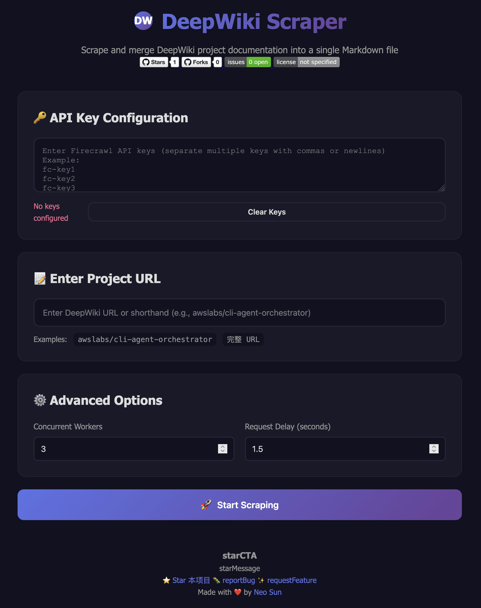

# DeepWiki Scraper

<div align="center">

[](https://github.com/neosun100/deepwiki-scraper/stargazers)
[](https://github.com/neosun100/deepwiki-scraper/network/members)
[](https://github.com/neosun100/deepwiki-scraper/issues)
[](https://github.com/neosun100/deepwiki-scraper/blob/main/LICENSE)
[](https://github.com/neosun100/deepwiki-scraper/commits/main)

[简体中文](README.zh-CN.md) | [繁體中文](README.zh-TW.md) | [English](README.en.md) | [日本語](README.ja.md)

</div>

---

DeepWikiプロジェクトのドキュメントをスクレイピングして単一のMarkdownファイルにマージするツール。コマンドラインとWebインターフェースをサポート。

## 📸 ユーザーインターフェース

<div align="center">



*GitHub バッジ、API キー管理、目立つ Star 誘導を備えたモダンなグラデーションテーマの Web インターフェース*

</div>

Web インターフェースの特徴：
- 🎨 **美しいデザイン**：紫色のグラデーションテーマとスムーズなアニメーション
- 🌐 **多言語サポート**：簡体字中国語、繁体字中国語、英語、日本語の切り替えが可能
- 🔑 **API キー管理**：永続的なストレージと複数キーのサポート
- 📊 **リアルタイム進捗**：視覚的なプログレスバーと詳細なステータス更新
- ⭐ **GitHub 統合**：バッジと Star 誘導でコミュニティを活性化

## ✨ 機能

- ✅ **スマートキャッシュ**：スクレイピング結果を自動保存、同じURLの場合は直接キャッシュを使用（⭐ 新機能）
- ✅ **Web UI インターフェース**：クールなグラデーションUI、リアルタイム進捗表示
- ✅ **APIキー永続化**：一度入力すれば永続的に記憶、ページを更新しても自動復元
- ✅ **マルチキーローテーション**：複数のAPIキーをサポート、自動でローテーション使用
- ✅ **スマートレート制限**：リクエスト間の自動遅延でレート制限を回避
- ✅ **リトライメカニズム**：エラー時の自動リトライで成功率を向上
- ✅ **並行スクレイピング**：並行スレッド数の設定が可能で効率アップ
- ✅ **Docker デプロイ**：ワンクリック起動、すぐに使える
- ✅ **コマンドラインツール**：スクリプト化されたバッチ処理をサポート

## 🚀 クイックスタート

### 方法1：Webインターフェース（推奨）

#### ローカル実行

```bash
# リポジトリをクローン
git clone https://github.com/neosun100/deepwiki-scraper.git
cd deepwiki-scraper

# ワンクリック起動
chmod +x start.sh
./start.sh
```

起動後にアクセス：
- **フロントエンドUI**：http://localhost:8002
- **APIドキュメント**：http://localhost:8003/docs

#### Docker デプロイ

```bash
# Docker Compose を使用
docker-compose up -d

# または Docker を使用
docker build -t deepwiki-scraper .
docker run -d -p 127.0.0.1:8002:8000 -p 127.0.0.1:8003:8001 -v $(pwd)/output:/app/output deepwiki-scraper
```

**注意**：ポートマッピングに `127.0.0.1` プレフィックスを使用して、ローカルアクセスのみを許可し、セキュリティを向上させています。

### 方法2：コマンドラインツール

```bash
# 依存関係をインストール
pip install -r requirements.txt

# API キーを設定
cp .env.example .env
# .env ファイルを編集して、Firecrawl API キーを入力

# 実行
python deepwiki_scraper.py awslabs/cli-agent-orchestrator
```

## 🎨 Webインターフェースの機能

### 1. スマートキャッシュシステム（⭐ 新機能）
- **自動保存**：スクレイピングした結果をoutputディレクトリに自動保存
- **スマート検出**：スクレイピング開始前にキャッシュの有無を自動チェック
- **ユーザー選択**：キャッシュが見つかった場合はポップアップで通知、キャッシュ使用か再スクレイピングかを選択可能
- **高速レスポンス**：キャッシュ使用時はAPI呼び出し不要、秒単位で結果を返す
- **永続保存**：キャッシュファイルは永続化され、サービス再起動後も利用可能

### 2. APIキー管理
- **自動保存**：入力後、ブラウザのlocalStorageに自動保存
- **永続記憶**：ページを更新しても自動復元、再入力不要
- **マルチキーサポート**：複数のキーをサポート、カンマまたは改行で区切る
- **負荷分散**：キーの順序を自動でランダム化し、リクエストの負荷を分散
- **ワンクリッククリア**：保存されたキーをいつでもクリア可能

### 3. リアルタイム進捗表示
- **プログレスバー**：スクレイピングの進行状況を視覚化
- **パーセンテージ**：完了率をリアルタイム更新
- **ページ数統計**：完了ページ数/総ページ数を表示
- **ステータスメッセージ**：詳細な現在の操作ステータス

### 4. クールなUIデザイン
- **グラデーションテーマ**：紫色のグラデーション配色
- **ダークモード**：目に優しい暗色背景
- **アニメーション効果**：スムーズなトランジションアニメーション
- **レスポンシブデザイン**：モバイルにも完璧に対応

## 📋 使用方法

### Webインターフェースの使用

1. **APIキーの設定**
   ```
   単一キー：
   fc-your-api-key

   複数キー（推奨）：
   fc-key1
   fc-key2
   fc-key3
   ```

2. **プロジェクトアドレスの入力**
   - 短縮形式：`awslabs/cli-agent-orchestrator`
   - 完全URL：`https://deepwiki.com/awslabs/cli-agent-orchestrator`

3. **詳細オプションの調整**（オプション）
   - 並行スレッド数：1-10（デフォルト 3）
   - リクエスト遅延：0.5-5秒（デフォルト 1.5）

4. **スクレイピング開始**
   - 「スクレイピング開始」ボタンをクリック
   - リアルタイム進捗を確認
   - 完了後、Markdownファイルをダウンロード

### コマンドラインの使用

```bash
# 基本的な使い方
python deepwiki_scraper.py awslabs/cli-agent-orchestrator

# 出力ファイルを指定
python deepwiki_scraper.py awslabs/cli-agent-orchestrator -o output.md

# 並行数と遅延を調整
python deepwiki_scraper.py awslabs/cli-agent-orchestrator -w 3 -d 2.0

# ヘルプを表示
python deepwiki_scraper.py --help
```

## 🔑 APIキーの取得

1. [Firecrawl](https://firecrawl.dev) にアクセス
2. アカウントを登録
3. コンソールでAPIキーを取得
4. Webインターフェースに入力または `.env` ファイルに追加

## 📦 プロジェクト構造

```
deepwiki-scraper/
├── README.md                 # プロジェクトドキュメント
├── requirements.txt          # Python依存関係
├── .env.example             # 環境変数テンプレート
├── .gitignore               # Git除外ルール
│
├── deepwiki_scraper.py      # コマンドラインツール
│
├── server.py                # FastAPIバックエンド
├── index.html               # Webフロントエンド
├── style.css                # スタイルファイル
├── app.js                   # フロントエンドロジック
│
├── Dockerfile               # Dockerイメージ
├── docker-compose.yml       # Docker Compose設定
├── docker-entrypoint.sh     # Docker起動スクリプト
├── start.sh                 # ローカル起動スクリプト
│
└── output/                  # 出力ディレクトリ
```

## 🛠️ 技術スタック

### バックエンド
- **FastAPI**：最新のPython Webフレームワーク
- **Uvicorn**：ASGIサーバー
- **HTTPX**：非同期HTTPクライアント
- **asyncio**：非同期並行処理

### フロントエンド
- **HTML5 + CSS3**：最新のWeb標準
- **Vanilla JavaScript**：フレームワーク依存なし
- **localStorage**：APIキーの永続化
- **Fetch API**：非同期リクエスト

### デプロイ
- **Docker**：コンテナ化デプロイ
- **Docker Compose**：ワンクリック起動

## 🔒 セキュリティの推奨事項

### 開発環境
- ✅ localhostでテスト
- ✅ APIキーはlocalStorageに保存
- ✅ APIキーをコードリポジトリにコミットしない

### 本番環境
- ⚠️ HTTPSを使用
- ⚠️ ファイアウォールルールを設定
- ⚠️ 定期的にAPIキーをローテーション
- ⚠️ リクエスト頻度制限を設定

## 📊 パフォーマンス最適化

### 1. 複数のAPIキーを使用
```
単一キー：最大並行数が制限される
複数キー：負荷分散、スループット向上
```

### 2. 並行数の調整
- ネットワーク良好：5-10に増やす
- ネットワーク不良：1-3を推奨
- キー多数：適度に増やす

### 3. 遅延の調整
- キー多数：1.0秒に減らす
- キー少数：1.5-2.0秒を推奨
- 429エラー時：2.5-3.0秒に増やす

## 🐛 トラブルシューティング

### Webインターフェースにアクセスできない
```bash
# ポートの使用状況を確認
lsof -i :8002
lsof -i :8003

# 使用中のプロセスを終了
kill -9 <PID>

# 再起動
./start.sh
```

### APIキーが保存されない
1. ブラウザでlocalStorageが無効になっていないか確認
2. ブラウザキャッシュをクリアして再試行
3. プライベートモード以外を使用

### Dockerコンテナが起動しない
```bash
# ログを確認
docker-compose logs

# 再ビルド
docker-compose down
docker-compose build --no-cache
docker-compose up -d
```

### スクレイピングが失敗する
1. APIキーが正しいか確認
2. ネットワーク接続を確認
3. リクエスト遅延を増やす
4. 並行数を減らす
5. さらにAPIキーを追加

## 📈 出力例

### コマンドライン出力
```
✓ 5個のAPIキーをロードしました

プロジェクトのスクレイピング開始: cli-agent-orchestrator
URL: https://deepwiki.com/awslabs/cli-agent-orchestrator
並行数: 3, 遅延: 1.5s

📥 ステップ 1/4: メインページをスクレイピング中...
✓ メインページのスクレイピング完了

🔍 ステップ 2/4: サブページリンクを抽出中...
✓ 36個のサブページを発見

📦 ステップ 3/4: すべてのサブページをスクレイピング中...
サブページをスクレイピング中: 100%|██████████| 36/36 [01:31<00:00, 2.53s/ページ]
✓ 36/36個のサブページのスクレイピングに成功

📝 ステップ 4/4: Markdownをマージ中...

==================================================
✅ 完了！
📄 出力ファイル: cli-agent-orchestrator.md
📊 総ページ数: 37
📝 ファイルサイズ: 776,577文字
==================================================
```

### Webインターフェース出力
- リアルタイムプログレスバー表示
- 詳細なステータスメッセージ
- 完了後に統計情報を表示
- ワンクリックで結果ファイルをダウンロード

## 🔄 更新履歴

### v2.1.0 (2025-10-26)
- ✨ スマートキャッシュシステムを追加
- ✨ スクレイピング結果の自動保存と再利用
- ✨ ユーザーがキャッシュ使用または再スクレイピングを選択可能
- 🔧 ポート設定を更新（8002/8003）してローカルアクセスを確保
- 📝 キャッシュ機能のドキュメントを完備

### v2.0.0 (2025-10-26)
- ✨ Web UIインターフェースを追加
- ✨ APIキー永続化機能を追加
- ✨ Dockerデプロイサポートを追加
- ✨ FastAPIバックエンドサービスを追加
- ✨ リアルタイム進捗表示を追加
- 🎨 クールなグラデーションUIデザイン
- 📝 ドキュメントと使用方法を完備

### v1.0.0 (2025-10-26)
- ✨ 基本的なコマンドラインツール
- ✨ マルチキーローテーションサポート
- ✨ スマートレート制限とリトライ
- ✨ 並行スクレイピング機能
- ✨ tqdmプログレスバー

## 📄 ライセンス

MIT License

## 🔗 関連リンク

- [Firecrawl 公式サイト](https://firecrawl.dev)
- [FastAPI ドキュメント](https://fastapi.tiangolo.com/)
- [Docker ドキュメント](https://docs.docker.com/)

## 🤝 コントリビューション

コードの貢献、問題の報告、提案を歓迎します！

1. このプロジェクトをFork
2. フィーチャーブランチを作成 (`git checkout -b feature/AmazingFeature`)
3. 変更をコミット (`git commit -m 'Add some AmazingFeature'`)
4. ブランチにプッシュ (`git push origin feature/AmazingFeature`)
5. Pull Requestを作成

## 📧 連絡先

- GitHub Issues: [問題を報告](https://github.com/neosun100/deepwiki-scraper/issues)
- GitHub: [@neosun100](https://github.com/neosun100)

---

<div align="center">

### ⭐ スター履歴

[](https://star-history.com/#neosun100/deepwiki-scraper&Date)

</div>

---

<div align="center">

## 🌟 スターをお願いします！🌟

**このプロジェクトが役に立った場合は、GitHubで ⭐ スターをお願いします！**

あなたのサポートが継続的な改善の最大の動機です！🚀

[](https://github.com/neosun100/deepwiki-scraper/stargazers)

[⭐ このリポジトリにスター](https://github.com/neosun100/deepwiki-scraper) | [🐛 バグ報告](https://github.com/neosun100/deepwiki-scraper/issues) | [✨ 機能リクエスト](https://github.com/neosun100/deepwiki-scraper/issues)

---

Made with ❤️ by [Neo Sun](https://github.com/neosun100)

</div>
