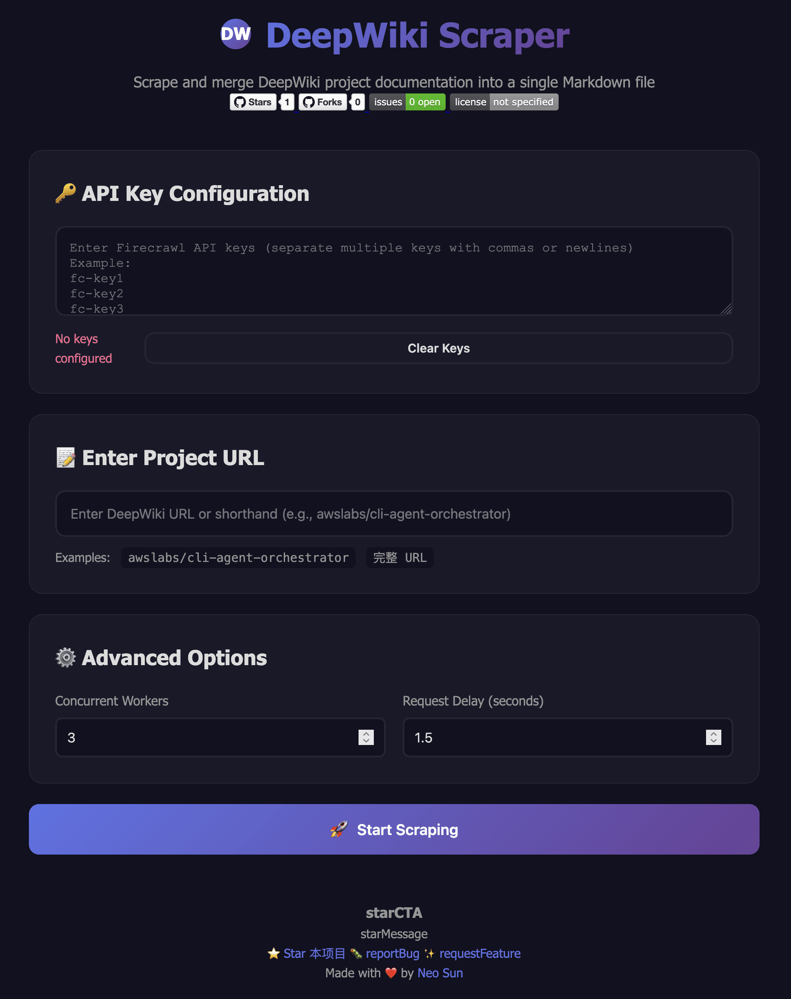

# DeepWiki Scraper

<div align="center">

[](https://github.com/neosun100/deepwiki-scraper/stargazers)
[](https://github.com/neosun100/deepwiki-scraper/network/members)
[](https://github.com/neosun100/deepwiki-scraper/issues)
[](https://github.com/neosun100/deepwiki-scraper/blob/main/LICENSE)
[](https://github.com/neosun100/deepwiki-scraper/commits/main)

[简体中文](README.zh-CN.md) | [繁體中文](README.zh-TW.md) | [English](README.en.md) | [日本語](README.ja.md)

</div>

---

A tool to scrape and merge DeepWiki project documentation into a single Markdown file, supporting both command-line and Web interface.

## 📸 User Interface

<div align="center">



*Modern gradient-themed web interface with GitHub badges, API key management, and prominent star encouragement*

</div>

The web interface features:
- 🎨 **Beautiful Design**: Purple gradient theme with smooth animations
- 🌐 **Multi-language Support**: Switch between Chinese (Simplified/Traditional), English, and Japanese
- 🔑 **API Key Management**: Persistent storage with multi-key support
- 📊 **Real-time Progress**: Visual progress bar and detailed status updates
- ⭐ **GitHub Integration**: Badges and star encouragement to engage the community

## ✨ Features

- ✅ **Smart Caching**: Automatically saves scraping results, directly uses cache for same URLs (⭐ New Feature)
- ✅ **Web UI Interface**: Cool gradient color interface with real-time progress display
- ✅ **API Key Persistence**: Remember forever after entering once, auto-restore on page refresh
- ✅ **Multi-Key Rotation**: Support multiple API keys configuration with automatic rotation
- ✅ **Smart Rate Limiting**: Automatic delay between requests to avoid rate limits
- ✅ **Retry Mechanism**: Auto-retry on errors to improve success rate
- ✅ **Concurrent Scraping**: Configurable concurrent threads for improved efficiency
- ✅ **Docker Deployment**: One-click startup, ready to use
- ✅ **Command-line Tool**: Support scripted batch processing

## 🚀 Quick Start

### Method 1: Web Interface (Recommended)

#### Local Run

```bash
# Clone repository
git clone https://github.com/neosun100/deepwiki-scraper.git
cd deepwiki-scraper

# One-click startup
chmod +x start.sh
./start.sh
```

After startup, visit:
- **Frontend Interface**: http://localhost:8002
- **API Documentation**: http://localhost:8003/docs

#### Docker Deployment

```bash
# Using Docker Compose
docker-compose up -d

# Or using Docker
docker build -t deepwiki-scraper .
docker run -d -p 127.0.0.1:8002:8000 -p 127.0.0.1:8003:8001 -v $(pwd)/output:/app/output deepwiki-scraper
```

**Note**: Port mapping uses `127.0.0.1` prefix to ensure only local access, enhancing security.

### Method 2: Command-line Tool

```bash
# Install dependencies
pip install -r requirements.txt

# Configure API key
cp .env.example .env
# Edit .env file and fill in your Firecrawl API key

# Run
python deepwiki_scraper.py awslabs/cli-agent-orchestrator
```

## 🎨 Web Interface Features

### 1. Smart Caching System (⭐ New Feature)
- **Auto-save**: Each scraping result is automatically saved to the output directory
- **Smart Detection**: Automatically checks for cache before starting scraping
- **User Choice**: Pop-up prompt when cache is found, can choose to use cache or re-scrape
- **Fast Response**: No API calls needed when using cache, returns results in seconds
- **Permanent Storage**: Cache files are persistently stored, still available after service restart

### 2. API Key Management
- **Auto-save**: Automatically saved to browser localStorage after input
- **Remember Forever**: Auto-restore on page refresh, no need to re-enter
- **Multi-key Support**: Support multiple keys, separated by comma or newline
- **Load Balancing**: Automatically randomizes key order to distribute request load
- **One-click Clear**: Can clear saved keys at any time

### 3. Real-time Progress Display
- **Progress Bar**: Visual display of scraping progress
- **Percentage**: Real-time update of completion percentage
- **Page Count**: Display completed/total pages
- **Status Messages**: Detailed current operation status

### 4. Cool UI Design
- **Gradient Theme**: Purple gradient color scheme
- **Dark Mode**: Eye-friendly dark background
- **Animation Effects**: Smooth transition animations
- **Responsive Design**: Perfect adaptation for mobile devices

## 📋 Usage Instructions

### Web Interface Usage

1. **Configure API Key**
   ```
   Single key:
   fc-your-api-key

   Multiple keys (recommended):
   fc-key1
   fc-key2
   fc-key3
   ```

2. **Enter Project Address**
   - Abbreviated form: `awslabs/cli-agent-orchestrator`
   - Full URL: `https://deepwiki.com/awslabs/cli-agent-orchestrator`

3. **Adjust Advanced Options** (optional)
   - Concurrent threads: 1-10 (default 3)
   - Request delay: 0.5-5 seconds (default 1.5)

4. **Start Scraping**
   - Click "Start Scraping" button
   - View real-time progress
   - Download Markdown file when complete

### Command-line Usage

```bash
# Basic usage
python deepwiki_scraper.py awslabs/cli-agent-orchestrator

# Specify output file
python deepwiki_scraper.py awslabs/cli-agent-orchestrator -o output.md

# Adjust concurrency and delay
python deepwiki_scraper.py awslabs/cli-agent-orchestrator -w 3 -d 2.0

# View help
python deepwiki_scraper.py --help
```

## 🔑 Getting API Key

1. Visit [Firecrawl](https://firecrawl.dev)
2. Register an account
3. Get API key from console
4. Enter in Web interface or add to `.env` file

## 📦 Project Structure

```
deepwiki-scraper/
├── README.md                 # Project documentation
├── requirements.txt          # Python dependencies
├── .env.example             # Environment variable template
├── .gitignore               # Git ignore rules
│
├── deepwiki_scraper.py      # Command-line tool
│
├── server.py                # FastAPI backend
├── index.html               # Web frontend
├── style.css                # Style file
├── app.js                   # Frontend logic
│
├── Dockerfile               # Docker image
├── docker-compose.yml       # Docker Compose configuration
├── docker-entrypoint.sh     # Docker startup script
├── start.sh                 # Local startup script
│
└── output/                  # Output directory
```

## 🛠️ Technology Stack

### Backend
- **FastAPI**: Modern Python web framework
- **Uvicorn**: ASGI server
- **HTTPX**: Async HTTP client
- **asyncio**: Asynchronous concurrent processing

### Frontend
- **HTML5 + CSS3**: Modern web standards
- **Vanilla JavaScript**: No framework dependencies
- **localStorage**: API key persistence
- **Fetch API**: Async requests

### Deployment
- **Docker**: Containerized deployment
- **Docker Compose**: One-click startup

## 🔒 Security Recommendations

### Development Environment
- ✅ Use localhost for testing
- ✅ API keys saved in localStorage
- ✅ Don't commit API keys to code repository

### Production Environment
- ⚠️ Use HTTPS
- ⚠️ Configure firewall rules
- ⚠️ Regularly rotate API keys
- ⚠️ Set request rate limits

## 📊 Performance Optimization

### 1. Use Multiple API Keys
```
Single key: Maximum concurrency limited
Multiple keys: Load balancing, improved throughput
```

### 2. Adjust Concurrency
- Good network: Can increase to 5-10
- Poor network: Recommend 1-3
- Many keys: Can increase appropriately

### 3. Adjust Delay
- Many keys: Can reduce to 1.0s
- Few keys: Recommend 1.5-2.0s
- Encountering 429: Increase to 2.5-3.0s

## 🐛 Troubleshooting

### Web Interface Inaccessible
```bash
# Check port usage
lsof -i :8002
lsof -i :8003

# Kill occupying process
kill -9 <PID>

# Restart
./start.sh
```

### API Key Not Saved
1. Check if browser has localStorage disabled
2. Clear browser cache and retry
3. Use non-private mode

### Docker Container Won't Start
```bash
# View logs
docker-compose logs

# Rebuild
docker-compose down
docker-compose build --no-cache
docker-compose up -d
```

### Scraping Failed
1. Verify API key is correct
2. Check network connection
3. Increase request delay
4. Reduce concurrency
5. Add more API keys

## 📈 Output Examples

### Command-line Output
```
✓ Loaded 5 API keys

Starting scrape for project: cli-agent-orchestrator
URL: https://deepwiki.com/awslabs/cli-agent-orchestrator
Concurrency: 3, Delay: 1.5s

📥 Step 1/4: Scraping main page...
✓ Main page scraping complete

🔍 Step 2/4: Extracting subpage links...
✓ Found 36 subpages

📦 Step 3/4: Scraping all subpages...
Scraping subpages: 100%|██████████| 36/36 [01:31<00:00, 2.53s/page]
✓ Successfully scraped 36/36 subpages

📝 Step 4/4: Merging Markdown...

==================================================
✅ Complete!
📄 Output file: cli-agent-orchestrator.md
📊 Total pages: 37
📝 File size: 776,577 characters
==================================================
```

### Web Interface Output
- Real-time progress bar display
- Detailed status messages
- Statistics display upon completion
- One-click download result file

## 🔄 Changelog

### v2.1.0 (2025-10-26)
- ✨ Added smart caching system
- ✨ Auto-save and reuse scraping results
- ✨ User can choose to use cache or re-scrape
- 🔧 Updated port configuration (8002/8003) to ensure local access
- 📝 Improved cache functionality documentation

### v2.0.0 (2025-10-26)
- ✨ Added Web UI interface
- ✨ Added API key persistence feature
- ✨ Added Docker deployment support
- ✨ Added FastAPI backend service
- ✨ Added real-time progress display
- 🎨 Cool gradient color UI design
- 📝 Improved documentation and usage instructions

### v1.0.0 (2025-10-26)
- ✨ Basic command-line tool
- ✨ Multi-key rotation support
- ✨ Smart rate limiting and retry
- ✨ Concurrent scraping functionality
- ✨ tqdm progress bar

## 📄 License

MIT License

## 🔗 Related Links

- [Firecrawl Official Website](https://firecrawl.dev)
- [FastAPI Documentation](https://fastapi.tiangolo.com/)
- [Docker Documentation](https://docs.docker.com/)

## 🤝 Contributing

Contributions, issue reports, and suggestions are welcome!

1. Fork this project
2. Create feature branch (`git checkout -b feature/AmazingFeature`)
3. Commit changes (`git commit -m 'Add some AmazingFeature'`)
4. Push to branch (`git push origin feature/AmazingFeature`)
5. Open Pull Request

## 📧 Contact

- GitHub Issues: [Submit Issue](https://github.com/neosun100/deepwiki-scraper/issues)
- GitHub: [@neosun100](https://github.com/neosun100)

---

<div align="center">

### ⭐ Star History

[](https://star-history.com/#neosun100/deepwiki-scraper&Date)

</div>

---

<div align="center">

## 🌟 Give Us a Star! 🌟

**If this project helps you, please give it a ⭐ Star on GitHub!**

Your support is the greatest motivation for us to keep improving! 🚀

[](https://github.com/neosun100/deepwiki-scraper/stargazers)

[⭐ Star this repo](https://github.com/neosun100/deepwiki-scraper) | [🐛 Report Bug](https://github.com/neosun100/deepwiki-scraper/issues) | [✨ Request Feature](https://github.com/neosun100/deepwiki-scraper/issues)

---

Made with ❤️ by [Neo Sun](https://github.com/neosun100)

</div>
